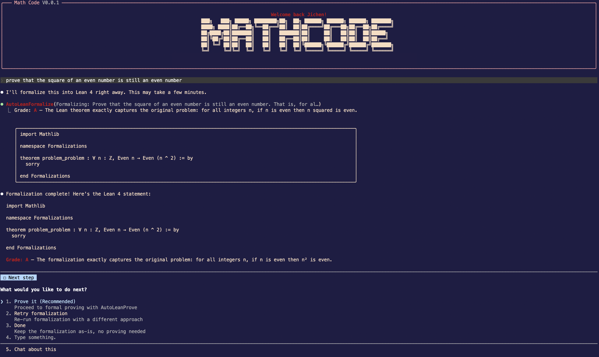

# MathCode

### MathCode: A Frontier Mathematical Coding Agent

```
███╗   ███╗ █████╗ ████████╗██╗  ██╗ ██████╗ ██████╗ ██████╗ ███████╗
████╗ ████║██╔══██╗╚══██╔══╝██║  ██║██╔════╝██╔═══██╗██╔══██╗██╔════╝
██╔████╔██║███████║   ██║   ███████║██║     ██║   ██║██║  ██║█████╗
██║╚██╔╝██║██╔══██║   ██║   ██╔══██║██║     ██║   ██║██║  ██║██╔══╝
██║ ╚═╝ ██║██║  ██║   ██║   ██║  ██║╚██████╗╚██████╔╝██████╔╝███████╗
╚═╝     ╚═╝╚═╝  ╚═╝   ╚═╝   ╚═╝  ╚═╝ ╚═════╝ ╚═════╝ ╚═════╝ ╚══════╝
```

**Project Page:** [math-ai-org/mathcode](https://github.com/math-ai-org/mathcode)

<p align="right"><a href="./README.md">English</a> | <strong>中文</strong></p>

MathCode 是一个终端 AI 编程助手，内置数学形式化引擎。输入一道自然语言数学题，它会自动将其转化为 Lean 4 定理并尝试完成形式化证明。



## 快速开始

```bash
git clone https://github.com/math-ai-org/mathcode.git
cd mathcode
bash setup.sh
codex auth login
mathcode
```

`setup.sh` 会准备发行版 checkout：下载或修复 bundle 内运行时，准备本地配置，并为后续 shell 安装 user-local 的 `mathcode` 启动命令。

如果当前 shell 还没有 reload profile，可以先用 bundle 内的即时兜底入口 `./run`。

### Setup 会负责什么

运行时文件：

- 如果运行时文件缺失、过旧、无法验证，或当前平台 payload 无效，就下载匹配的
  `mathcode-vX.Y.Z-<os>-<arch>.tar.gz`
- 在需要修复时，从 archive 恢复 `./mathcode`、`./mathcode-webui` 和
  `vendor/ripgrep/`
- 使用 `shasum` 或 `sha256sum` 校验当前平台的 `SHA256SUMS.txt` 条目
- 替换已有可用安装前，先校验下载得到的运行时文件
- 记录 CLI 和 WebUI helper 的 release metadata，方便后续 `setup.sh` 和
  `setup.sh --status` 发现过旧或无法验证的二进制

本地配置：

- 在需要时从 `.env.example` 创建 `.env`
- 默认在 `~/.local/bin/` 安装受管的 user-local `mathcode` launcher
- 创建 `skills/`、`tools/`、`plugins/` 扩展目录
- 在 `vendor/ripgrep/` 内自带 MathCode 内部搜索使用的 `rg` 二进制

Lean 工具链：

- 默认使用 bundle-local 的完整 `.local/elan` Lean/Lake 工具对
- 接受 Git Bash/MSYS 下可见的 `lean.exe` / `lake.exe`
- 在 bootstrap Lean workspace 前先修复不完整的本地 elan 工具文件
- 仅在 `MATHCODE_SETUP_USE_SYSTEM_LEAN=1` 且系统 `lean` / `lake` 都可用时
  复用系统 Lean/Lake，并保留现有 `ELAN_HOME`

### Launcher 和 PATH 行为

setup 只会覆盖它自己之前创建过的 launcher 文件，避免覆盖已有但不属于这次安装的 `mathcode` 命令。

如果设置了 `MATHCODE_INSTALL_BIN_DIR`，相对路径会先按 bundle 根目录解析成绝对路径，
再写入 launcher、记录状态文件和受管 PATH 配置块。

即使该目录已经在当前 shell 的 `PATH` 里，setup 也会刷新受管 profile 配置块，
让之后新开的 shell 继续识别 `mathcode`。

如果选定的 launcher 目录无法使用，setup 只会跳过 launcher 步骤，其余安装流程继续执行。

当 `MATHCODE_SETUP_USE_SYSTEM_LEAN=1` 时，setup 会在切换到 bundle 根目录前捕获系统
`lean` / `lake` 路径。

未设置这个 opt-in 时，`--status` 会报告默认的本地 `.local/elan` 路径，
而不会把系统 Lean 当成已安装。

生成的 `.env` 路径值会按 shell 规则引用，因此 bundle 路径里包含 `$` 或单引号等字符时，`./run` source `.env` 后仍会保留字面值。

### 维护命令

```bash
bash setup.sh --status   # 检查二进制和依赖是否健康
bash setup.sh --clean    # 删除安装产物，但保留证明结果和 vault 数据
bash setup.sh --help     # 查看全部 setup 参数
```

`setup.sh --status` 会检查：

- `./mathcode --version` 和 checksum 是否匹配当前 release tag 的 metadata
- `./mathcode-webui` 是否匹配记录的 release metadata
- 当前平台的 bundled `rg` 是否可执行并能输出 ripgrep 版本信息

`setup.sh --clean` 会保留 `LeanFormalizations/` 和 vault 里的用户输出。

如果 setup 曾经记录过受管 launcher，之后即使不再设置
`MATHCODE_INSTALL_BIN_DIR`，`--status` 和 `--clean` 也会继续跟踪它。

## 环境要求

- macOS (arm64) 或 Linux (x86_64)
- `curl`，用于 setup/bootstrap 下载
- `shasum` 或 `sha256sum`，用于校验 release archive 并写入 metadata
- 足够的磁盘空间用于 bundle、Lean 工具链和 Mathlib cache
- 如果你想走默认后端和默认数学流程，需要本机安装 `codex` CLI
- Python 3.12+（可选，仅 `tools/` 目录下的分析脚本需要）

## 常用命令

### CLI

```bash
mathcode -p "prove that the square of an even number is even"
echo "hello" | mathcode -p
mathcode --help
```

如果当前 shell 还没 reload，可以使用 bundle 内兜底入口：

```bash
./run -p "prove that the square of an even number is even"
echo "hello" | ./run -p
./run --help
```

数学结果会写到 `LeanFormalizations/`。

### 浏览器 UI

```bash
./run webui
```

`./run webui` 会先 source bundle 内的 `.env`，再启动本地 daemon，并打印浏览器认证 URL。

如果直接运行打包后的 `./mathcode-webui` helper，它会先重新进入同目录的
`./run webui` wrapper。

直接运行和 wrapper 运行会使用同一份 `.env`、本地 Lean 工具链和 bundle 默认配置。
如果同目录 wrapper 存在但无法执行，会作为启动失败报告。

### Goal 和命令限制

- `MATHCODE_GOAL_MAX_TOKEN_BUDGET` 会限制 source `/goal`、`/goal` daemon
  commands 和 `/api/v1/sessions/:id/goal` 接受的 token budget。它支持与
  `/goal` 相同的正整数、整数值小数和 `k`/`m`/`b` 紧凑格式；未设置或非法值会回退到
  `1000000000`。
- `MATHCODE_MAX_CHAINED_COMMAND_INPUTS` 会限制 `QueryEngine` abort 前允许的嵌套本地
  slash-command next-input 提交数量。未设置或非法值会回退到 `25`。

### Goal 命令语法

交互式发布版 session 支持：

- `/goal <token-budget> <objective>`
- `/goal --budget <token-budget>`
- `/goal --budget=<token-budget>`
- 可选的 `--max-continuations N` 或 `--max-continuations=<N>`
- `/goal pause`、`/goal resume`、`/goal status`、`/goal clear`
- 裸 `/goal`、`/goal help`、`/goal -h`、`/goal --help`

该命令会继续同一个 session，不会启动单独 agent。以 `/` 开头的 objective
会作为普通 goal 文本提交，不会再次解析成 slash command。

budget 后的第一个 objective token 可以是 `--help`。objective 解析已经开始后，
flag-like token 会保留为 objective 文本，除非后置的有效 `--budget`
正在用于提供必需的显式 budget。

当 `--budget` 被解析为 budget 选项时，非法值会被拒绝，包括这样的数值表达式
objective：

```text
1 + 1 ... --budget nope
```

### 模型 Effort

`--effort <level>` 或交互式 `/effort <level>` 可使用 `low`、`medium`、
`high`、`max` 或正整数；`/effort auto` 和 `/effort unset` 会让当前
session 回到模型默认值。
CLI 模型覆盖里的保留值 `default` 会按大小写不敏感匹配；自定义模型 ID
会保留原始大小写。

### 自定义 Agent

自定义 agent 定义会 trim `description`、JSON `prompt`、markdown prompt 正文、`initialPrompt`，以及 `effort`、`permissionMode`、`memory`、`isolation` 这类 JSON enum 字段。

空白的必填 description/prompt 会被拒绝，空白的可选 initial prompt 会被忽略；
JSON `skills` 列表会按 markdown frontmatter 的规则归一化。

### Session 诊断、Compaction 和任务

交互式 context 显示会保留诊断信息：

- `/context` 在交互式和非交互式会话里使用同一套可见 markdown transcript 输出
- markdown 表格会转义单元格内容
- slash-command 和 deferred built-in tool 明细保持可见
- 显示 MCP loaded/available 状态
- current-usage 表格会排除 deferred categories
- manual compact reserve 会作为 reserved buffer 展示
- 当前 usage 为空时仍显示 free/reserved 行
- malformed token rows 和 zero-token synthetic windows 不会产生非法建议百分比
- server-side/MCP tool blocks 会计入 message breakdown

Compact 和 autocompact 路径会：

- 钳制异常阈值、token 计数、legacy content shape 和空白 tool ID
- 保留 singleton tool-result 配对
- 把 statusline、away summary、survey、sticky prompt UI 限定到 compact 后的活跃 transcript
- partial compact 后抑制陈旧 warning
- 合并重复的远端 compacting 状态

任务处理：

- `/tasks`、`TaskStop` 和 SDK `stop_task` 不会把可选中的 leader 行计入 running teammate
- 可以停止 pending remote agent 和 running in-process teammate
- task tools 和 SDK `stop_task` 会 trim task id
- deprecated `shell_id` 以及 TaskOutput `agentId`/`bash_id` alias
  可以回填空白 `task_id`
- legacy `wait_up_to` 秒数会被归一化
- 会跨用户可见的 status shape 恢复旧版持久化 task status
- 接受 legacy `TaskUpdate` status alias
- 拒绝空白任务文本字段
- task metadata key 会被 trim，空白或不安全的 `__proto__` metadata key 会被拒绝
- TaskOutput timeout 必须是整数值
- idle in-process teammate output 会被视为可读取，而不是等到 timeout
- TaskOutput/TaskStop 的混合 text/structured result 数组会正确回放
- legacy TaskOutput output 回放会保留类似 `<error>` 的普通文本
- command 空白被 trim 时不会误显示 TaskStop 截断省略号
- 很矮的终端里仍显示隐藏任务摘要，recently completed 行会按时过期

Shell sleep 自动后台化和 path validation 会识别：

- decimal、suffix、signed、exponent 和 trailing-dot duration，例如
  `sleep 2s`、`sleep 2m`、`sleep +2` 和 `sleep 2e0`
- `env ... sleep 2s` 这类 wrapped shell 写法
- PowerShell quoted、commented、redirected 和 module-qualified sleep command，
  例如 `& 'sleep' 2`、`Start-Sleep -Seconds:2 > $null` 和
  `Microsoft.PowerShell.Utility\Start-Sleep -Seconds 2`
- TimeSpan `-Duration` 值，以及 PowerShell 参数缩写和 common parameters
- 短、小数、signed 和 exponent `timeout` wrapper

## 功能特性

### 持久化 Lean REPL

启用持久化 Lean 语言服务器，实现亚秒级编译检查：

```env
MATHCODE_LEAN_REPL=1
```

一次性 ~90 秒预热（导入 Mathlib）后，后续每次编译检查仅需 **~0.4 秒**（而非 ~30 秒）。错误检测和通过确认均近乎即时。REPL 自动导入你的定理库和公理库。

### 定理库

自动存储已证明的定理，供未来证明复用：

```bash
/theorem-store on     # 启用（写入 .env）
/theorem-store off    # 禁用
/theorem-store sync   # 补录所有已证明但未入库的定理
/theorem-store status # 查看入库数量和 vault 信息
```

启用后，每个成功证明的定理会自动命名并追加到 `TheoremLib/Stored.lean`。Planner 和 prover 可以导入并直接复用这些定理，无需重新推导。

### 公理库

将对话中的假设存储为持久化、一致性检查的声明：

```bash
/axiomatize "A 比 B 快"             # 形式化 + 存储
/axiomatize list                     # 查看所有活跃公理
/axiomatize check                    # 一致性审查
/axiomatize remove <name>            # 删除一个声明
```

公理按 vault 存储，带有 Lean 形式化，经过编译检查，并自动注入到形式化和证明的提示中。支持任何领域：数学、物理、化学、叙事、通用。

### Lean LSP 集成

启用 Lean LSP 以获得更智能的 lemma 检索和结构化报错：

```env
MATHCODE_USE_LSP=1
```

启用后，prover 会：

- 在 planning 前通过 leansearch.net 和 Loogle 检索已验证的 Mathlib lemma 名
- 用带行列号和严重级别的 LSP 诊断代替原始 stderr
- 在出错位置提取 proof goal，给后续 repair 更精确的上下文
- 将搜索结果和 vault 知识注入 planner 和 prover 提示

LSP 已内置——不需要单独安装。

### Obsidian 定理图谱

生成 Obsidian vault，以知识图谱的形式可视化定理依赖关系：

```bash
/obsidian on       # 启用并从已有形式化结果生成
/obsidian off      # 禁用
/obsidian generate # 立即重新生成
```

启用后，每次形式化和证明都会自动更新 vault。在 Obsidian 中打开并使用 Graph View
查看定理与引理之间的关系。

每个引理条目都包含通过 `#print` 从 Mathlib 查询到的完整 Lean 定义。

### Agent 模式证明

每个证明会话变成一个完整的交互式对话，Agent 使用工具迭代地证明定理：

```env
MATHCODE_AGENT_PROVE=1
```

建议同时启用 Obsidian 定理图谱（Agent 会读取 vault 获取上下文）。启用后，Agent 可以：

- 检索 vault 中的相关 Mathlib 引理
- 编写证明候选并通过持久化 REPL 编译
- 读取编译错误、搜索修复方案并重新编译（每个会话最多 10 次）
- 实时输出推理过程和工具调用

### 子目标树分解证明

将复杂定理分解为独立子目标并行证明：

```env
MATHCODE_TREE_PROVE=1
MATHCODE_MAX_TREE_DEPTH=2    # 递归深度（默认：1）
```

分解器生成带有 `have ... := by sorry` 占位符的骨架。每个子目标独立证明（如果某个失败，协同取消其他子目标）。已证明的子目标体被缝合回骨架并编译检查。

### 多规划器

并行运行多个规划器以获得多样化的证明策略：

```env
MATHCODE_NUM_PLANNERS=3
```

每个规划器会提出不同的策略，所有发现的引理都会保存到 vault 中。prover 综合所有方案选择最优路径。默认值为 1（单规划器）。

### 定时 Agent 循环

发行版自带循环调度能力，不需要额外构建参数。

在交互式 MathCode 会话里可以直接用：

```bash
/loop 10m check the deploy
/loop 1h /standup 1
```

短期提醒或监控建议直接用这种循环；如果你希望任务在重启后继续保留，就在交互式会话里创建持久化定时任务。

## 可扩展性

MathCode 支持三种扩展机制：

### 技能 (`skills/`)

放入 `.md` 文件即可添加领域特定知识和证明策略。启动时自动发现。

### 工具 (`tools/`)

放入带有 YAML frontmatter 的 Python `.py` 脚本即可添加分析工具。启动时自动发现。

4 个分析工具已包含：`axiom_checker`、`sorry_analyzer`、`proof_stats`、`lib_search`。仅在使用这些工具时才需要 Python 3.12+。

### 插件 (`plugins/`)

放入带有 `.mathcode-plugin/plugin.json` 清单的插件文件夹，即可添加命令、技能、
Agent、MCP 服务器、钩子等。

通过 `--plugin-dir` 加载，或在 MathCode 内通过 `/plugin` 从 Git 仓库安装。

## 后端设置

### 默认 Codex/OpenAI 路线

默认路线不需要改 `.env`：

```bash
codex auth login
mathcode
```

如果你还在刚执行完 setup 的同一个 shell 里，先用 `./run` 也可以；reload shell 之后再直接用 `mathcode`。

如果你想改成 Anthropic 兼容后端，可以设置：

```env
MATHCODE_USE_OPENAI=0

ANTHROPIC_API_KEY=sk-ant-...
ANTHROPIC_MODEL=claude-sonnet-4-5
```

如果你还想让数学工具也停止使用 `codex exec`，再加：

```env
AUTOLEAN_USE_CODEX=0
```

Shell 里导出的环境变量优先级高于 `.env`。

### WebUI Provider 密钥

WebUI 设置页里的 provider-key 行只包含 daemon 当前能传给真实 child session 的
secret：`anthropic` 和 `openrouter`。Codex/OpenAI 路线使用 Codex OAuth，
不使用 `OPENAI_API_KEY` 行。
WebUI 的 `minimal` reasoning effort 会在 OpenAI/OpenRouter 路线上保留；
在 Anthropic 兼容路线中会映射到 CLI 当前可用的最低档 `low`。

### 打包的 Provider 依赖

发行版二进制会打包 Anthropic 兼容、Bedrock、Vertex 和 Foundry 分支所需的
provider SDK，以及 MCPB/DXT plugin package；这些路线不需要源码 checkout
里的 `node_modules`。Bedrock、Vertex 和 Foundry 使用各自 provider 的认证方式，
不使用 Anthropic 兼容的 `ANTHROPIC_AUTH_TOKEN` / `apiKeyHelper` bearer headers。

## 常见问题

**Q: setup 之后立刻执行 `mathcode` 还是找不到命令**

开一个新的 shell，或者执行：

```bash
source ~/.zshrc
```

如果你想在 reload 之前先继续使用，也可以直接运行：

```bash
./run
```

**Q: `./run` 报 `exec format error`、`Bad CPU type in executable` 或类似启动错误**

通常是因为下载了错误平台的二进制。重新执行 `bash setup.sh`，或者手动从 GitHub Releases 下载匹配你平台的 asset。

**Q: 启动时提示缺少 Codex 认证**

执行：

```bash
codex auth login
```

**Q: 能不能不 clone，直接下载 release asset**

可以。你也可以直接从 GitHub Releases 下载 `.tar.gz` bundle 后解压使用。

这个 archive 本身是自包含的；只有当 bundled runtime 文件缺失、过旧或无法验证时，
`bash setup.sh` 才会再从 GitHub 下载。bootstrap 仓库只是把 `bash setup.sh`
作为默认路径。

## Star History

想看项目的关注度变化，可以直接查看下面的 Star History 图表：

[](https://www.star-history.com/#math-ai-org/mathcode&Date)

## 引用

如果你在研究中使用 MathCode，可以按下面的方式引用：

```bibtex
@misc{mathcode2026,
  title = {MathCode: A Frontier Mathematical Coding Agent},
  author = {Team Math-AI},
  journal = {math-ai-org.github.io},
  year = {2026},
  month = {April},
  url = "https://github.com/math-ai-org/mathcode"
}
```

## 社区

加入我们的 Discord 获取帮助、反馈和讨论：**[discord.gg/f2AFP9W5](https://discord.gg/f2AFP9W5)**

## 致谢

MathCode 的数学形式化与证明流水线基于 [AUTOLEAN](https://github.com/T3S1AMAX/autolean.git) 项目。
